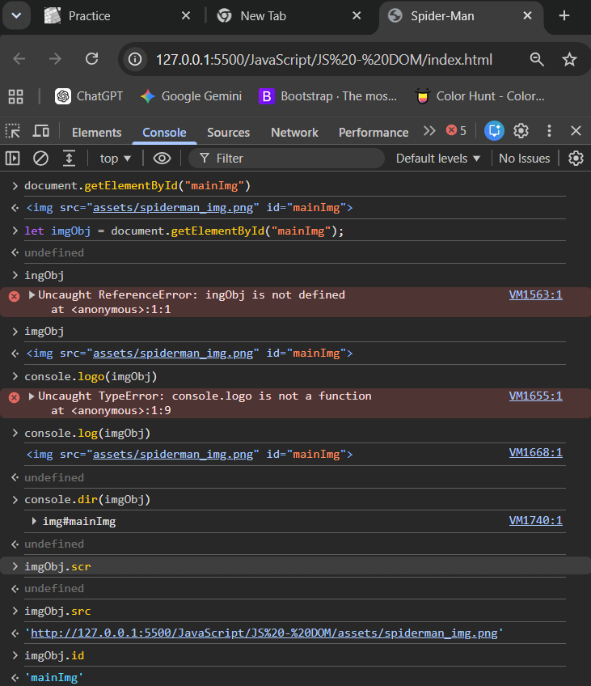
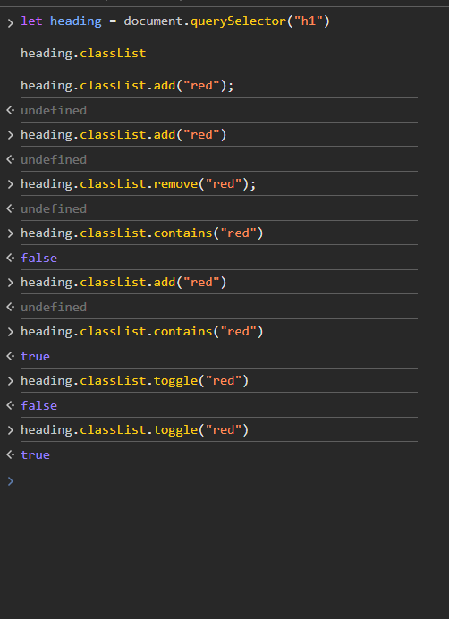
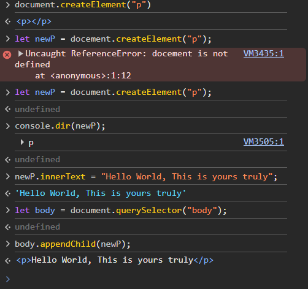
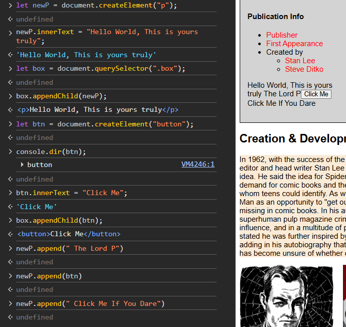
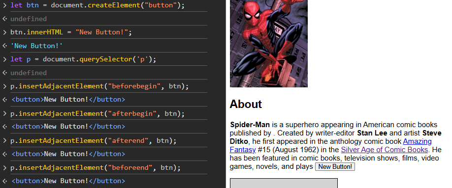

# DOM

### Document Object Model
- The dom represents a document with a logical tree.
- It allows us to manipulate/change webpage content (HTML elements).

console.dir(document);

### Selecting Elements

1. getElementByID("id") Here id is name  (Document Method)
- Returns the Element as an object or null(If not found)

ex: document.getElementsById("mainImg")



In js, file paths are Strings, so they must be inside quotes
imgObj.src = "assets/creation_1.png";


2. getElementsByClassName("") 
- returns the elements as a html collection or empty collection(if not found)

ex: document.getElementsByClassName("oldImg")[0]

3. getElementsByTagName("")
- returns the elements as a html collection or empty collection(if not found)

ex: document.getElementsByTagName("p") 

### Query Selectors

- allows us to use any CSS selector
```js
- document.querySelector('p') //Selects first p element
- document.querySelector('#myId') //selects first element with id = myId
- document.querySelector('.myClass') //selects first element with class = myClass
- document.querySelectorAll('p') //selects all p elements
```

<i>First object match is returened even if multiple objects present</i>

```js
-console.dir(document.querySelector("div a")); //select first anchor tag
```


## Using Properties & Methods

1. innerText shows the visible text contained in a node
```js
para.innerText = "<b>Hi, I am abc</b>"
'<b>Hi, I am abc</b>' //No change
```

2. textContent shows all the full text(hidden)(according to html seqencing
)


3. innerHTML shows the full markup(hidden)

```js
para.innerHTML = "<b>Hi, I am abc</b>"
'<b>Hi, I am abc</b>' //Now it works
heading.innerHTML = `<i><u>${heading.innerText}</u></i>`;
```


## Manipulating Attributes

ex: id, class, style, img=>src, etc

```js

- obj.getAttribute(attr) //getters

- obj.setAttribute(attr, val) //setters - for changing 

img.getAttribute("id")
'mainImg'
img.setAttribute("id", "spiderman")
undefined
```
- <i>If we change Attr then all its styling will be removed and will go back to normal</i>
- <i>One attribute at a time only so we dont use it much</i>

## Manipulating Style

### style property

- objStyle

<i> in CSS we write background-image but here when assigned in JS it turns into camelCase backgroundImage</i>

<b>It is set in Inline style not in CSS file. So its not used freqently</b>

```js
let heading = document.querySelector("h1")
undefined
heading.style
CSSStyleDeclaration 

heading.style.color = "red"
'red'
heading.style.backgroundColor = "cyan";
'cyan'

//In JS file
let links = document.querySelectorAll(".box a")

for(link of links){
    link.style.color = "purple";
}

//OR

for(let i=0; i<links.length; i++){
    links[i].style.color = "red";
}
```

### Using classList

- obj.classList

```js
classList.add() //to add new classes
classList.remove() //to remove classes
classList.contains() //to check if class exists
classList.toggle() //to toggle between add and remove
```



## Navigation

- parentElement  (only one parent)

- children

- previousElementSibling / nextElementSibling

- also  box.childElementCount for no. of children

## Adding Elements

```js
document.createElement('p')

appendChild(element)// At the end
append(element) // Edit the inner Text
prepend(element) // Add at the start
insertAdjacent(where, element)

```
 - insertAdjacentElement(position, element)
Parameters
position
A string representing the position relative to the targetElement; must match (case-insensitively) one of the following strings:

- 'beforebegin': Before the targetElement itself.
- 'afterbegin': Just inside the targetElement, before its first child.
- 'beforeend': Just inside the targetElement, after its last child.
- 'afterend': After the targetElement itself.








## Remooving Elements

- removeChild(element)

- remove(element)

```js
let body = document.querySelector("body");
undefined
body.removeChild("btn");


btn.innerHTML = "NEW BUTTON!";
'NEW BUTTON!'
btn.remove();
```